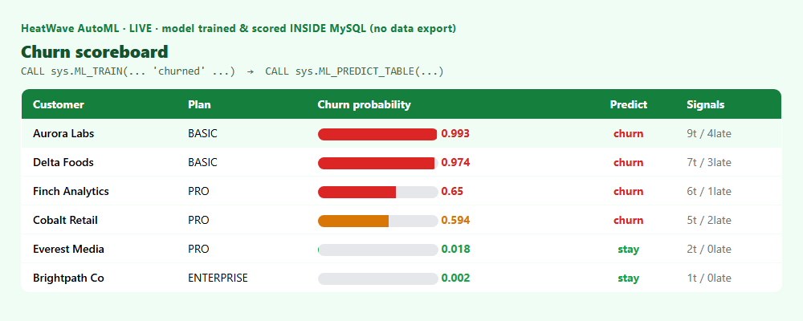

# Train and Score a Model in SQL — MySQL HeatWave AutoML

*Predict churn with two SQL calls. No data export, no notebook, no separate model server.*

---

**📋 At a glance**

- **📦 Repository:** [github.com/khadayatepa/heatwave-automl](https://github.com/khadayatepa/heatwave-automl)
- **Tech stack:** MySQL HeatWave AutoML (ML_TRAIN, ML_PREDICT_TABLE) · SQL · Python
- **Database:** MySQL HeatWave 9.7 (9.7.0-cloud)
- **Prerequisites:** Python 3.10+, mysql-connector-python; HeatWave AutoML enabled
- **Best for:** Training and scoring an ML model (e.g. churn) in pure SQL, with no data export.
- **Level:** Beginner–Intermediate


The usual ML loop exports features to a notebook, trains elsewhere, and stands up a model service. MySQL HeatWave keeps it all in the database: `ML_TRAIN` builds the model, `ML_PREDICT_TABLE` scores your rows. The data, the model, and the predictions never leave MySQL.

## 1) Train — one call
```sql
CALL sys.ML_TRAIN('heatwave_ai.churn_train', 'churned',
                  JSON_OBJECT('task','classification'), @churn_model);
CALL sys.ML_MODEL_LOAD(@churn_model, NULL);
```

## 2) Score — one call
```sql
CALL sys.ML_PREDICT_TABLE('heatwave_ai.customers', @churn_model,
                          'heatwave_ai.customers_scored', NULL);
SELECT name, ml_results->>'$.predictions.churned' AS churn,
       ml_results->'$.probabilities."1"'          AS churn_prob
FROM customers_scored ORDER BY churn_prob DESC;
```

## It works — verified live


*Trained and scored entirely inside MySQL HeatWave — the model flags the high-ticket, late-paying BASIC customers.*

## 🛠️ Do it yourself — step by step (manual SQL)

Paste these into any MySQL client.

**1) Load labelled training data**

```sql
CREATE DATABASE IF NOT EXISTS heatwave_ai; USE heatwave_ai;
CREATE TABLE churn_train (tenure_months INT, monthly_spend INT, support_tickets INT,
                          late_payments INT, plan VARCHAR(20), churned INT);
INSERT INTO churn_train VALUES
 (4,39,9,4,'BASIC',1),(48,180,1,0,'ENTERPRISE',0),(11,70,5,2,'PRO',1),
 (30,140,2,0,'PRO',0),(7,30,7,3,'BASIC',1),(36,160,1,0,'ENTERPRISE',0);
-- (load as many labelled rows as you have)
```

**2) Train the model (this can take a minute)**

```sql
CALL sys.ML_TRAIN('heatwave_ai.churn_train', 'churned',
                  JSON_OBJECT('task','classification'), @model);
SELECT @model;            -- the model handle
```

**3) Load the model into HeatWave**

```sql
CALL sys.ML_MODEL_LOAD(@model, NULL);
```

**4) Add the customers you want to score**

```sql
CREATE TABLE customers (name VARCHAR(40), tenure_months INT, monthly_spend INT,
                        support_tickets INT, late_payments INT, plan VARCHAR(20));
INSERT INTO customers VALUES
 ('Aurora Labs',4,39,9,4,'BASIC'),('Brightpath Co',48,180,1,0,'ENTERPRISE');
```

**5) Score them**

```sql
CALL sys.ML_PREDICT_TABLE('heatwave_ai.customers', @model,
                          'heatwave_ai.customers_scored', NULL);
```

**6) Read the predictions**

```sql
SELECT name,
       ml_results ->> '$.predictions.churned'   AS churn,
       ml_results ->  '$.probabilities."1"'      AS churn_prob
FROM customers_scored ORDER BY churn_prob DESC;
```


## Run it
```
pip install -r requirements.txt
copy .env.example .env
python automl.py
```

## Why it matters
- **No data movement.** Training data, model, and predictions stay in MySQL.
- **Scoring is just SQL.** Join predictions to any query or dashboard.
- **AutoML.** HeatWave selects and tunes the model for you.

📦 **Full code on GitHub:** [github.com/khadayatepa/heatwave-automl](https://github.com/khadayatepa/heatwave-automl)

---

*About the author: **Prashant Khadayate** is an **Oracle ACE** focused on Oracle AI Database (26ai), MySQL HeatWave, and AI in the database. Connect on [LinkedIn](https://www.linkedin.com/in/prashant-khadayate-1a8b0b97/).*

> A learning demo on synthetic data.
